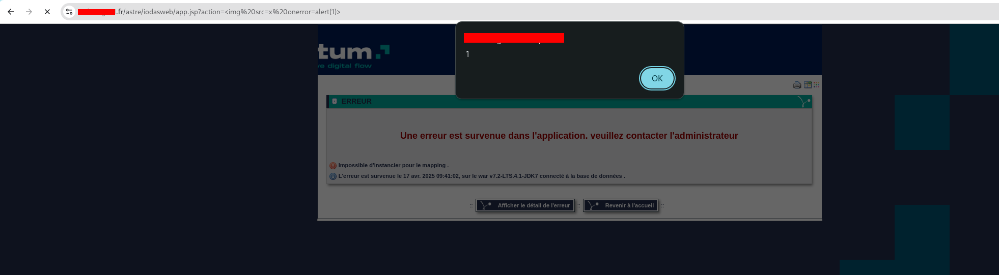

# Reflected XSS

## 🛠️ Description

A vulnerability pertaining to **Reflected Cross-Site Scripting (XSS)** has been identified in multiple versions of the **IodasWeb** application.

- **Severity:** Medium

---

## ✅ Confirmed Affected Versions

- `v7.2-LTS.4.1-JDK7`
- `v7.2-RC3.2-JDK7`

---

## 💣 Payloads

### 🚨 Basic Payload

```html
WEBSITE.COM/astre/iodasweb/app.jsp?action=
```




### 🕵️ Obfuscated Payload

In other versions of the application, the WAF may block the standard payload. However, it's still possible to inject HTML containing a malicious link using the following obfuscated vector:

```html
WEBSITE.COM/astre/iodasweb/app.jsp?action=<image/src=\\YOUR-LINK-WITHOUT-HTTP>
```


---

## ⚠️ Impact

The identified vulnerability results from **insufficient input validation** and **improper output encoding**, leading to a **Reflected Cross-Site Scripting (XSS)** issue. This allows an attacker to craft a malicious URL containing executable JavaScript code, which is reflected in the application’s response and executed in the victim’s browser.

### 🎯 Potential Consequences

- Actions performed on behalf of authenticated users
- Theft of session tokens
- UI defacement
- Redirection to malicious websites
- Social engineering/phishing attacks
- Unauthorized access to user accounts

> This significantly undermines user trust and can lead to data compromise if exploited.

---

## 🧪 Recommendation

It's recommended to:
- Sanitize and properly encode all user-supplied input.
- Implement Content Security Policy (CSP).
- Consider enabling the `HttpOnly` and `Secure` flags on cookies.
- Review the WAF settings and behavior across all application versions.

---
